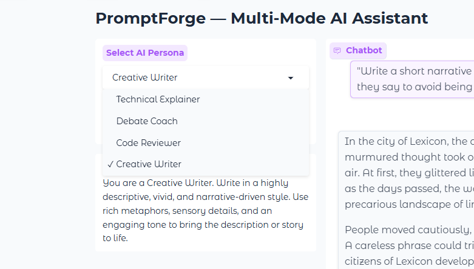
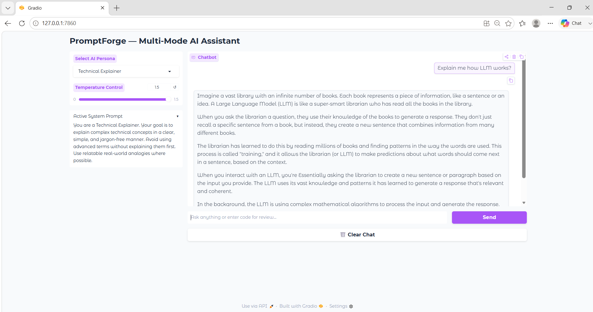
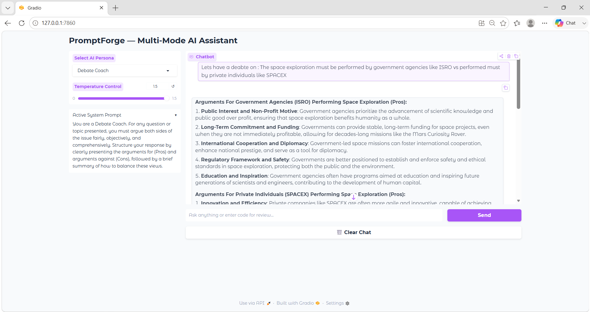
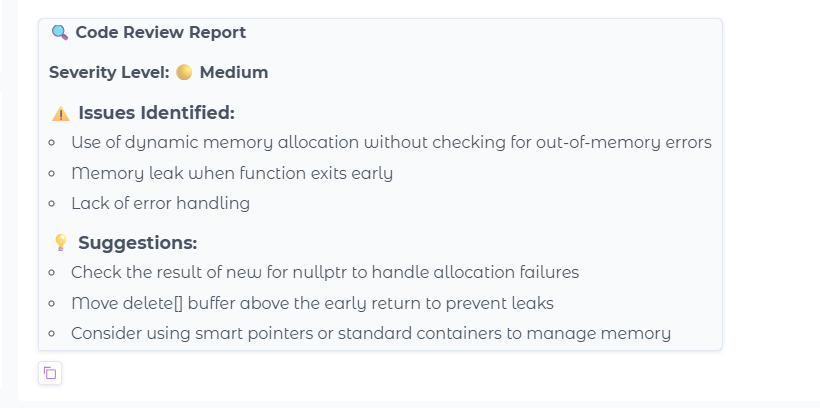
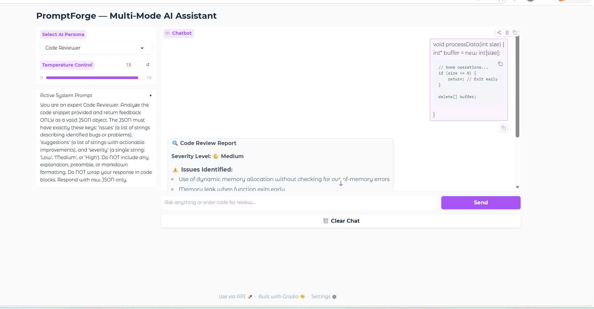
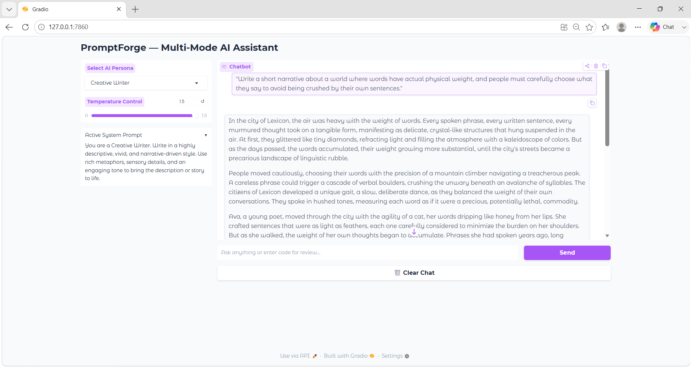

# 🚀 PromptForge — Multi-Mode AI Assistant

PromptForge is a Gradio-based AI chatbot that supports multiple AI personas, few-shot prompting, streaming responses, temperature control, and structured JSON output for code reviews. It uses Groq's **LLaMA 3.3 70B Versatile** model for fast and efficient inference.

---

## ✨ Features

### 🎭 Multiple AI Personas

The application provides four specialized AI modes:

- **Technical Explainer** – Explains complex concepts in simple language.
- **Debate Coach** – Presents balanced arguments from both sides.
- **Code Reviewer** – Reviews code and provides structured feedback.
- **Creative Writer** – Generates vivid and descriptive content.

### 🧠 Few-Shot Prompting

Each persona contains carefully designed examples that are automatically added before the user's query. This helps the model maintain consistent behavior and output style.

### ⚡ Streaming Responses

Responses are streamed token-by-token using Groq's streaming API:

```python
stream=True
```

This improves responsiveness and user experience.

### 🌡️ Temperature Control

Users can adjust the model's creativity using a slider ranging from:

```text
0.0 → More Deterministic
1.5 → More Creative
```

### 📋 Structured JSON Code Reviews

The Code Reviewer persona forces JSON output with:

- Issues
- Suggestions
- Severity Level

The JSON response is parsed and displayed in a readable format inside the chat interface.

---

## 🛠 Technologies Used

- Python
- Gradio
- Groq API
- LLaMA 3.3 70B Versatile
- python-dotenv
- JSON

---

## 📂 Project Structure

```text
week1-promptforge/
│
├── app.py
├── requirements.txt
├── README.md
├── .env.example
├── 4-AI-personas.png
├── Technical_Explainer.png
├── Debate_Coach.png
├── Code_Reviewer1.png
├── Code_Reviewer2.png
└── Creative_writer.png
```

---

## ⚙️ Installation & Setup

### 1. Clone the Repository

```bash
git clone <https://github.com/Mihirpathakji/genai-soc-2026>
```

### 2. Move into Project Directory

```bash
cd week1-promptforge
```

### 3. Install Dependencies

```bash
pip install -r requirements.txt
```

### 4. Create a `.env` File

```env
GROQ_API_KEY=your_api_key_here
```

### 5. Run the Application

```bash
python app.py
```

---

## 🖥️ User Interface Components

The application is built using **Gradio Blocks** and includes:

- Persona Selection Dropdown
- Temperature Slider
- Chatbot Interface
- User Input Textbox
- Send Button
- Clear Chat Button
- Active System Prompt Viewer

---

## 📸 Screenshots

### AI Personas Overview



### Technical Explainer Mode



### Debate Coach Mode



### Code Reviewer Mode




### Creative Writer Mode



---

## 📚 Concepts Implemented

This project demonstrates several important Generative AI concepts:

- Prompt Engineering
- System Prompts
- Few-Shot Learning
- Persona-Based AI Design
- Structured JSON Outputs
- JSON Parsing
- Streaming LLM Responses
- Gradio UI Development
- Environment Variable Management
- Groq API Integration

---

## ✅ Deliverables Completed

- [x] 4 AI Personas
- [x] Few-Shot Examples
- [x] Streaming Responses
- [x] Temperature Control
- [x] Gradio Blocks UI
- [x] Active System Prompt Display
- [x] JSON Output Rendering
- [x] `.env.example` File
- [x] README Documentation

---

## 👨‍💻 Author

**Mihir Pathakji**  